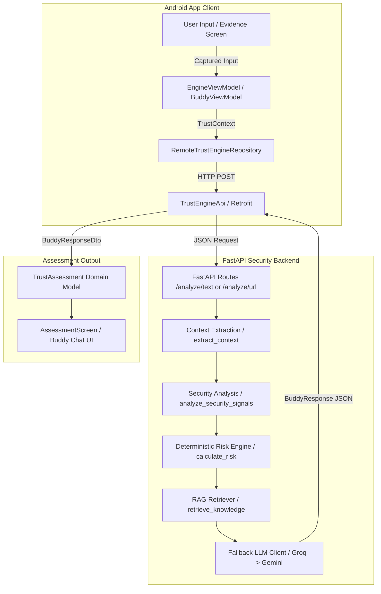
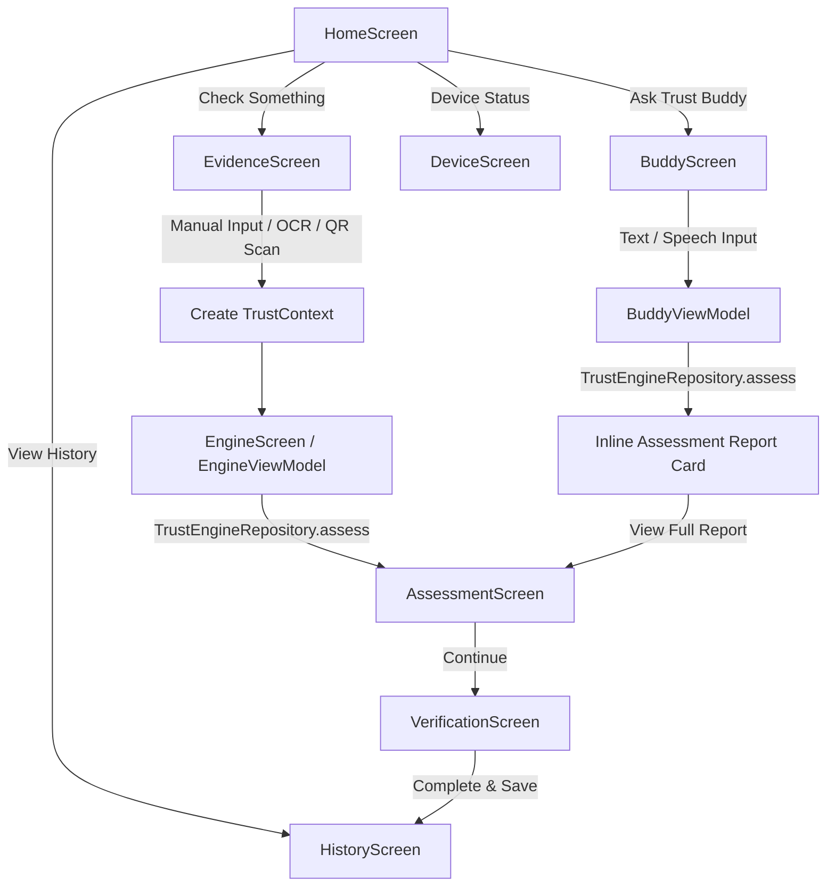

# Buddy — AI Financial Firewall / Trust Layer

**Buddy** is an AI-assisted financial security layer designed to help users evaluate potentially dangerous financial messages, URLs, QR/payment-related evidence, and other suspicious content before they trust, open, share, or act on it.

The central design philosophy behind Buddy is:

> *"Do not build an LLM that detects scams. Build a financial security system that uses an LLM."*

Architecturally, this principle dictates that:
- **Deterministic security and risk logic** is the primary source of truth.
- **Contextual signal extraction** parses natural language, brand mentions, and urgency indicators.
- **Security threat analysis** evaluates domain extensions, credential harvesting attempts, and brand impersonation.
- **RAG (Retrieval-Augmented Generation)** provides grounded scam and security knowledge.
- **LLM capabilities** (Groq / Gemini) are restricted to reasoning and user-facing explanations without the authority to override security classifications or risk scores.
- **Android** serves as the evidence capture layer, interactive user interface, and assessment presentation engine.
- **FastAPI** acts as the centralized security intelligence backend.

---

## 1. THE PROBLEM

Financial scams, phishing attacks, and social engineering are increasingly sophisticated, targeting individuals through SMS, messaging apps, and deceptive websites:
- **Phishing Messages & Urgent Tactic Scams:** Messages threatening account suspension ("Your SBI account will be blocked today") exploit user panic to bypass rational judgment.
- **Deceptive URLs & Brand Impersonation:** Lookalike domains (e.g., `sbi-verify-login.xyz`) mimic trusted financial institutions to steal login credentials and OTPs.
- **QR & Payment Fraud:** Malicious QR codes encode fraudulent payment URIs or redirect users to phishing sites.
- **Credential Harvesting:** Unsolicited requests for PINs, CVVs, passwords, or one-time passwords (OTPs).
- **Inadequacy of Traditional Antivirus:** Standard browser warnings and signature-based antivirus solutions often fail to detect real-time contextual social engineering that relies on psychological pressure rather than malicious software binaries.

---

## 2. THE SOLUTION

Buddy sits between the user and untrusted digital communications as an active financial security firewall.

### Intended Evaluation Flow

```
User Provides Evidence (Text / URL / Image / Speech)
        ↓
Context Extraction (URLs, Brand Mentions, Urgency, Actions)
        ↓
Security Signal Analysis (URL Analysis, Threat Intel)
        ↓
Deterministic Risk Engine (Calculates 0–100 Risk Score & Classification)
        ↓
RAG Knowledge Base (Retrieves Grounded Scam Context)
        ↓
LLM Explanation Layer (Generates Human-Readable Explanation & Action)
        ↓
Structured Assessment Output
        ↓
Android Assessment UI (Displays Risk Score, Signals, & Safe Guidance)
        ↓
User Safety Decision
```

Buddy clearly delineates between:
1. **Evidence:** Raw text, links, or QR payloads captured by the user.
2. **Analysis:** Deterministic keyword and threat-signal detection.
3. **Risk Classification:** Objective risk score (`0–100`) and risk level (`SAFE`, `SUSPICIOUS`, `HIGH_RISK`).
4. **Explanation:** Contextual, easy-to-understand breakdown of detected warning signs.
5. **Recommended Action:** Clear, non-destructive guidance (e.g., "Do not click", "Verify through official bank website").

---

## 3. KEY FEATURES

| Feature | Description | Status |
| :--- | :--- | :--- |
| **Text Analysis** | Analyzes natural language messages for urgency, account threats, and credential requests. | **Implemented** |
| **URL Analysis** | Evaluates links for suspicious keywords, TLDs, IP addresses, and brand impersonation. | **Implemented** |
| **Deterministic Risk Engine** | Calculates 0–100 risk score and classification (`SAFE`, `SUSPICIOUS`, `HIGH_RISK`). | **Implemented** |
| **RAG Security Knowledge** | Retrieves grounded scam knowledge entries to inform LLM explanations. | **Implemented** |
| **LLM Reasoning & Explanation** | Generates user-friendly explanations using Groq with Gemini fallback. | **Implemented** |
| **Ask Trust Buddy (Chat)** | Conversational assistant interface with inline risk report previews. | **Implemented** |
| **Voice Input (STT)** | On-device speech recognition via Android `RecognizerIntent` for hands-free query entry. | **Implemented** |
| **OCR Text Extraction** | On-device ML Kit Text Recognition for parsing text directly from screenshots. | **Implemented** |
| **On-Device QR Scanning** | On-device ML Kit Barcode Scanning for decoding QR image payloads. | **Implemented** |
| **Risk Assessment Screen** | Renders score cards, risk badges, detected signals, and guidance recommendations. | **Implemented** |
| **Verification Flow** | Interactive safety checklist guiding users through non-destructive verification actions. | **Implemented** |
| **Session & Persistent History** | Stores completed assessments locally (`trust_history.json`) with summary statistics. | **Implemented** |
| **Runtime Engine Switcher** | Live toggle switch in Device Status screen to alternate between Mock Engine and Remote API. | **Implemented** |
| **Backend QR File Upload** | Direct multipart file upload endpoint for backend-side QR processing. | **In Development** |
| **Automatic System-Wide SMS Interception**| Automatic background scanning of incoming OS-level SMS. | **Planned** |

---

## 4. HOW IT WORKS

### Complete Technical Pipeline



---

## 5. ANDROID ARCHITECTURE

The Android application follows **Clean Architecture** principles combined with **MVVM** and the **Service Locator** pattern:

```
app/src/main/java/com/buddy/trustlayer/
├── MainActivity.kt                  # Main Activity Entry Point
├── core/
│   ├── common/
│   │   ├── AppConfig.kt            # Centralized Base URL & Engine Mode Toggle
│   │   ├── AppContainer.kt         # Service Locator (OkHttp, Retrofit, Repositories)
│   │   └── ViewModelFactory.kt     # DI Factory for ViewModels
│   └── navigation/
│       ├── AppNavigation.kt        # NavHost & Bottom Navigation Bar Shell
│       └── Screen.kt               # Parameterized Route Definitions
├── data/
│   ├── local/
│   │   └── LocalHistoryRepository.kt# JSON File-Backed Persistence (trust_history.json)
│   ├── remote/
│   │   ├── ApiModels.kt            # Network DTOs with @SerializedName
│   │   └── TrustEngineApi.kt       # Retrofit HTTP Interface
│   └── repository/
│       ├── InMemoryRepositories.kt # Context & History Repository Wrappers
│       ├── MockTrustEngineRepository.kt # Offline Keyword Heuristics Repository
│       └── RemoteTrustEngineRepository.kt # Production Retrofit Repository
├── domain/
│   ├── model/
│   │   ├── RiskLevel.kt            # Enum (LOW, MEDIUM, HIGH, CRITICAL)
│   │   ├── TrustAssessment.kt     # Assessment Domain Entity
│   │   └── TrustContext.kt        # Evidence Context Domain Entity
│   └── repository/
│       └── TrustEngineRepository.kt # Primary Domain Repository Interface
├── feature/
│   ├── assessment/AssessmentScreen.kt
│   ├── buddy/BuddyScreen.kt & BuddyViewModel.kt
│   ├── device/DeviceScreen.kt
│   ├── engine/EngineScreen.kt & EngineViewModel.kt
│   ├── evidence/EvidenceScreen.kt
│   ├── history/HistoryScreen.kt
│   ├── home/HomeScreen.kt
│   └── verification/VerificationScreen.kt
└── ui/theme/                       # Material 3 Dark Theme System
```

### Data Layer Separation
- **Domain Independence:** `TrustAssessment` and `TrustContext` contain zero dependencies on Android, Compose, or Retrofit packages.
- **DTO Mapping:** `BuddyResponseDto` uses Gson `@SerializedName` annotations to map Python `snake_case` fields (e.g., `risk_score`, `recommended_action`) into Kotlin properties.
- **Null Safety:** All response DTO fields are nullable with safe defaults, ensuring malformed or missing backend JSON fields never crash the client.

---

## 6. BACKEND ARCHITECTURE

The FastAPI security backend orchestrates signal detection, risk calculation, knowledge retrieval, and LLM explanation generation:

```
backend/
├── requirements.txt                 # Python Dependencies
├── start_server.py                  # Background Server Startup Script
├── app/
│   ├── main.py                     # FastAPI Application Initialization
│   ├── api/
│   │   └── routes.py               # Endpoint Route Handler
│   ├── extraction/
│   │   └── context.py              # Context & URL Extractor
│   ├── llm/
│   │   ├── client.py               # Abstract LLM Interface
│   │   ├── fallback.py             # Primary (Groq) -> Fallback (Gemini) Handler
│   │   ├── gemini_client.py        # Gemini API Client
│   │   ├── groq_client.py          # Groq API Client
│   │   └── schemas.py              # Structured LLM Output Schemas
│   ├── pipeline/
│   │   └── analyzer.py             # Pipeline Orchestrator (analyze_input)
│   ├── qr/
│   │   ├── classifier.py           # QR Payload Classifier
│   │   └── decoder.py              # OpenCV QR Decoder
│   ├── rag/
│   │   ├── knowledge_base.json     # Grounded Security Knowledge Base
│   │   └── retriever.py            # RAG Search & Scoring Engine
│   ├── risk/
│   │   └── engine.py               # Deterministic Risk Scoring Engine
│   ├── schemas/
│   │   └── analysis.py             # Pydantic Request & Response Models
│   ├── security/
│   │   ├── engine.py               # Security Signal Aggregator
│   │   ├── threat_cache.py         # Local Threat Cache
│   │   ├── threat_intel.py         # External Threat Intelligence Client
│   │   ├── url_analyzer.py         # Heuristic URL Analyzer
│   │   └── url_normalizer.py       # URL Normalization Utility
│   └── upi/                        # UPI Payment Parser & Client
```

---

## 7. API REFERENCE

### 1. Analyze Text
- **HTTP Method:** `POST`
- **Endpoint:** `/analyze/text`
- **Request Body:**
```json
{
  "text": "Your SBI account will be blocked today. Complete KYC immediately: https://sbi-verify-login.xyz"
}
```

### 2. Analyze URL
- **HTTP Method:** `POST`
- **Endpoint:** `/analyze/url`
- **Request Body:**
```json
{
  "url": "https://sbi-verify-login.xyz"
}
```

### 3. Response Schema (`BuddyResponse`)
Used by all analysis endpoints:
```json
{
  "risk_score": 80,
  "classification": "HIGH_RISK",
  "threats": [
    "Urgency manipulation",
    "Account threat or pressure tactic",
    "Suspicious URL keywords: verify, login",
    "Suspicious domain extension",
    "Possible financial brand impersonation: sbi"
  ],
  "explanation": "The message says your SBI account will be blocked today and urges you to complete KYC using the link https://sbi-verify-login.xyz. Security evidence shows multiple high-risk signals...",
  "recommended_action": "Do NOT click the link or provide any personal or financial information. Independently verify the status of your SBI account by contacting SBI through official channels.",
  "rag_knowledge": [
    {
      "id": "malicious_url",
      "topic": "malicious URL",
      "knowledge": "Suspicious URLs can indicate phishing or other malicious activity..."
    }
  ]
}
```

### 4. Analyze QR Code (Backend Endpoint)
- **HTTP Method:** `POST`
- **Endpoint:** `/analyze/qr`
- **Request Body:**
```json
{
  "image_path": "/path/to/server/image.png"
}
```
*Current Backend Limitation Note:* The backend `/analyze/qr` endpoint expects a local server filesystem `image_path` string. On Android, QR codes are currently decoded on-device using ML Kit Barcode Scanning, and the resulting payload is routed directly to `/analyze/url` or `/analyze/text`.

---

## 8. RISK ASSESSMENT

The deterministic Risk Engine (`backend/app/risk/engine.py`) calculates the risk score based on cumulative security signals:

| Signal / Feature | Score Contribution |
| :--- | :--- |
| **Possible Brand Impersonation** | +20 |
| **Credential Request (OTP, PIN, Password)** | +20 |
| **Account Threat (Blocked / Suspended)** | +15 |
| **UPI Invalid VPA** | +15 |
| **IP Address Used as URL** | +15 |
| **Threat Intelligence Match** | +40 |
| **Suspicious URL Keywords (`verify`, `login`)** | +10 |
| **Suspicious TLD (`.xyz`, `.top`, `.click`)** | +10 |
| **Urgency Manipulation** | +10 |
| **Financial Action Requested (KYC, Refund)** | +5 |
| **Financial Brand Mentioned** | +5 |

### Risk Classification Thresholds
- **`0 – 14`**: `SAFE`
- **`15 – 60`**: `SUSPICIOUS`
- **`61 – 100`**: `HIGH_RISK`

### Android Domain Mapping
`RemoteTrustEngineRepository` maps backend classifications to Android domain `RiskLevel` enums:
- `"SAFE"`, `"LOW"` → `RiskLevel.LOW`
- `"SUSPICIOUS"`, `"MEDIUM"`, `"MODERATE"` → `RiskLevel.MEDIUM`
- `"HIGH"`, `"HIGH_RISK"` → `RiskLevel.HIGH`
- `"CRITICAL"`, `"CRITICAL_RISK"`, `"SEVERE"` → `RiskLevel.CRITICAL`

---

## 9. AI / RAG / LLM ARCHITECTURE

```
                  +-----------------------------------+
                  |   Deterministic Risk Engine       |
                  |  (Calculates Score & Classification) |
                  +-----------------------------------+
                                    │
                                    ▼ [Authoritative Verdict]
+-------------------+     +-------------------+     +---------------------+
| Context Extractor | --> | Security Analyzer | --> | RAG Retriever       |
+-------------------+     +-------------------+     | (knowledge_base.json)|
                                                    +---------------------+
                                                               │
                                                               ▼ [Security Context]
                                                    +---------------------+
                                                    | Fallback LLM Client |
                                                    |  1. Groq (Primary)  |
                                                    |  2. Gemini (Fallback)|
                                                    +---------------------+
                                                               │
                                                               ▼ [Explanation & Guidance]
                                                    +---------------------+
                                                    |   Structured Output  |
                                                    +---------------------+
```

### Core AI Principles
1. **Engine Primacy:** The LLM does **NOT** determine the final risk score or security classification. System instructions strictly prohibit the LLM from overriding or altering the Risk Engine's decision.
2. **Fallback Mechanism:** `FallbackLLMClient` attempts primary inference via Groq (`openai/gpt-oss-120b`). If Groq fails or times out, it seamlessly falls back to Google Gemini (`gemini-3.6-flash`).
3. **Grounded RAG:** `retriever.py` searches `knowledge_base.json` for matching security signals and terms, supplying grounded scam context to the LLM to eliminate hallucinations.

---

## 10. ANDROID USER FLOW



---

## 11. SETUP

### Prerequisites
- Android Studio Ladybug (2024.2.1+) or newer
- JDK 11+
- Python 3.12+
- Android Emulator or physical device (Android 7.0+ / API 24+)

### 1. Backend Setup

```bash
# Navigate to backend directory
cd backend

# Create and activate virtual environment
python -m venv venv

# On Windows PowerShell:
.\venv\Scripts\activate.ps1

# On Linux/macOS:
source venv/bin/activate

# Install dependencies
pip install -r requirements.txt

# Create .env file with your API keys
cp .env.example .env

# Run FastAPI server
uvicorn app.main:app --host 0.0.0.0 --port 8000
```

### 2. Android Setup
1. Open the project root in Android Studio.
2. Ensure Android Emulator is running.
3. Build the project using Gradle:
```bash
.\gradlew.bat :app:assembleDebug
```
4. Deploy to emulator or device via Android Studio or ADB.

---

## 12. ENVIRONMENT VARIABLES

Backend configuration requires API keys specified in `backend/.env`:

```env
# Gemini API Key (Google GenAI)
GEMINI_API_KEY="your_gemini_api_key_here"

# Groq API Key
GROQ_API_KEY="your_groq_api_key_here"

# URLhaus Threat Intel Auth Key (Optional)
URLHAUS_AUTH_KEY="your_urlhaus_key_here"
```

> [!IMPORTANT]
> `.env` is listed under `.gitignore` and must **NEVER** be committed to version control. Android source code contains zero API keys.

---

## 13. ANDROID ↔ BACKEND CONNECTION

- **Development Host Loopback:** The Android client defaults to `AppConfig.BACKEND_BASE_URL = "http://10.0.2.2:8000/"`. In the Android Emulator, `10.0.2.2` automatically routes to `localhost` on the development host machine.
- **Cleartext Traffic:** `AndroidManifest.xml` includes `android:usesCleartextTraffic="true"` to permit unencrypted HTTP development calls to local port `8000`.
- **Physical Device Connections:** To test on a physical phone over local Wi-Fi, update `AppConfig.BACKEND_BASE_URL` to your workstation's LAN IP address (e.g., `http://192.168.1.50:8000/`).

---

## 14. TESTING

### 1. Android Unit Tests
Includes DTO serialization and deserialization tests verifying Gson `@SerializedName` mapping and nullability handling:
```bash
.\gradlew.bat :app:testDebugUnitTest
```
*Current Status:* **5 passed, 0 failed.**

### 2. Backend Risk Engine Tests
Includes deterministic risk calculation tests:
```bash
cd backend
python test_risk_engine.py
```

### 3. Build Verification
```bash
.\gradlew.bat :app:assembleDebug
```
*Current Status:* **BUILD SUCCESSFUL.**

---

## 15. SECURITY CONSIDERATIONS

- **Secrets Isolation:** Provider API keys reside exclusively on the FastAPI backend in `.env`.
- **Network Timeouts:** OkHttp is configured with 30-second timeouts (`connect`, `read`, `write`) to safely accommodate LLM response generation without dropping socket connections.
- **Development Cleartext HTTP:** Cleartext HTTP (`http://10.0.2.2:8000/`) is enabled for local hackathon development and should be upgraded to HTTPS for production releases.
- **Minimal Permissions:** Android app requests only `android.permission.INTERNET`.

---

## 16. CURRENT LIMITATIONS

1. **Backend QR Mobile Upload Contract:** The backend `/analyze/qr` route currently expects a local server `image_path` string. On Android, QR codes are decoded on-device via ML Kit, and the decoded text/URL is routed to `/analyze/text` or `/analyze/url`.
2. **Local History Persistence:** Assessments are persisted locally to `trust_history.json` on disk. While history survives app restarts, a full SQLite Room database migration remains on the roadmap.
3. **Development Cleartext Traffic:** Uses unencrypted HTTP for local emulator communication.
4. **Placeholder Attachment Flows:** File attachment box in `EvidenceScreen` is a UI placeholder; image inputs are handled via camera/gallery OCR and QR buttons.

---

## 17. ROADMAP

### Near Term
- Upgrade backend `/analyze/qr` route to accept multipart `UploadFile` image uploads.
- Migrate local history file storage (`trust_history.json`) to Room SQLite Database.

### Medium Term
- Enforce HTTPS and SSL pinning for backend API communication.
- Implement background SMS receiver for automatic scam detection on incoming messages.

### Long Term
- Experiment with on-device Small Language Models (SLMs) for offline reasoning.
- Expand UPI payment verification integrations.

---

## 18. PROJECT STRUCTURE

```
trust-layer/
├── README.md                        # Primary Project Documentation
├── LICENSE                          # MIT License
├── build.gradle.kts                 # Root Build Script
├── settings.gradle.kts              # Root Project Settings
├── gradle/
│   └── libs.versions.toml           # Version Catalog
├── app/
│   ├── build.gradle.kts             # App Module Build Script
│   └── src/
│       ├── main/
│       │   ├── AndroidManifest.xml  # App Manifest
│       │   └── java/com/buddy/trustlayer/
│       │       ├── MainActivity.kt  # Compose Activity Entry Point
│       │       ├── core/            # Common Config, Navigation & Theme
│       │       ├── data/            # Local Persistence, Remote DTOs & Repositories
│       │       ├── domain/          # Domain Models & Interfaces
│       │       └── feature/         # Compose Screens & ViewModels
│       └── test/                    # Unit Tests
└── backend/
    ├── requirements.txt             # Python Dependencies
    ├── test_risk_engine.py          # Risk Engine Unit Tests
    └── app/
        ├── main.py                  # FastAPI Application Entry
        ├── api/routes.py            # API Route Handlers
        ├── extraction/context.py    # Context Extractor
        ├── llm/                     # Groq & Gemini Clients + Fallback
        ├── pipeline/analyzer.py     # Security Pipeline Orchestrator
        ├── qr/                      # QR Decoder & Classifier
        ├── rag/                     # RAG Knowledge Base & Retriever
        ├── risk/engine.py           # Deterministic Risk Engine
        ├── schemas/analysis.py      # Pydantic Request/Response Models
        ├── security/                # Signal Analyzers & Threat Intel
        └── upi/                     # UPI Payment Analyzers
```

---

## 19. TECHNOLOGY STACK

| Layer | Technology | Purpose |
| :--- | :--- | :--- |
| **Android Language** | Kotlin 2.2.10 | Client Application Language |
| **UI Framework** | Jetpack Compose + Material 3 | Declarative User Interface |
| **Navigation** | Compose Navigation 2.8.3 | Screen Transitions & Deep Linking |
| **HTTP Client** | Retrofit 2.11.0 + OkHttp | REST API Networking |
| **JSON Parser** | Gson 2.11.0 | Serialization & Deserialization |
| **On-Device ML** | Google ML Kit (Text & Barcode) | On-Device OCR & QR Decoding |
| **Backend Framework**| FastAPI 0.141.1 + Uvicorn | High-Performance Python Web API |
| **LLM Providers** | Groq (Primary) / Gemini (Fallback) | User-Facing Explanations & Advice |
| **Data Validation** | Pydantic 2.13.5 | Request & Response Schema Validation |

---

## 20. DEVELOPMENT PHILOSOPHY

1. **Security-First Architecture:** Security decisions are deterministic and objective.
2. **LLM as an Explanation Layer:** LLMs generate user guidance; they do not dictate safety scores or risk levels.
3. **Client-Backend Separation:** Android handles capture and UI presentation; FastAPI handles security intelligence.
4. **Fail-Safe Fallbacks:** Fallback logic at both the LLM provider level (Groq -> Gemini) and client level (Remote API -> Mock Engine) ensures user safety and app stability.

---

## 21. HACKATHON / PROJECT CONTEXT

Buddy was built for hackathon demonstration as a prototype of a phone-first AI Financial Firewall. The architecture proves that real-time contextual analysis, deterministic risk scoring, and LLM explanations can be combined into a clean, mobile-first security experience.

---

## 22. CONTRIBUTING

1. Fork the repository.
2. Create a feature branch (`git checkout -b feature/new-capability`).
3. Commit your changes (`git commit -m 'Add new capability'`).
4. Push to the branch (`git push origin feature/new-capability`).
5. Open a Pull Request.

---

## 23. LICENSE

This project is licensed under the [MIT License](LICENSE).  
Copyright (c) 2026 KARTHIK NAIR.

---

## 24. README CONSISTENCY AUDIT

1. **API Endpoints Verified:** `/analyze/text`, `/analyze/url`, `/analyze/qr` match `backend/app/api/routes.py`.
2. **Pydantic Schemas Verified:** `TextAnalysisRequest`, `URLAnalysisRequest`, and `BuddyResponse` match `backend/app/schemas/analysis.py`.
3. **Android DTOs Verified:** `TextAnalysisRequestDto`, `UrlAnalysisRequestDto`, and `BuddyResponseDto` match `ApiModels.kt`.
4. **Android Package Tree Verified:** `core`, `data`, `domain`, `feature` match the source directory structure.
5. **Limitations Disclosed:** QR mobile contract, cleartext HTTP, and local JSON history limitations are fully disclosed.
6. **Zero Secrets Exposed:** `.env` is uncommitted and referenced via placeholders.
7. **Setup Commands Verified:** `uvicorn app.main:app` and `.\gradlew.bat :app:assembleDebug` are exact working build commands.
8. **Mock vs Real Labeled:** `MockTrustEngineRepository` is explicitly documented as a local development fallback.
